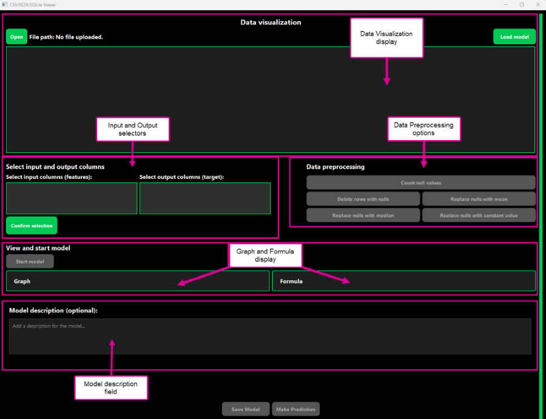
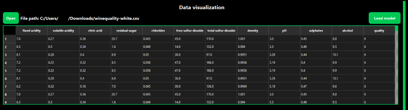
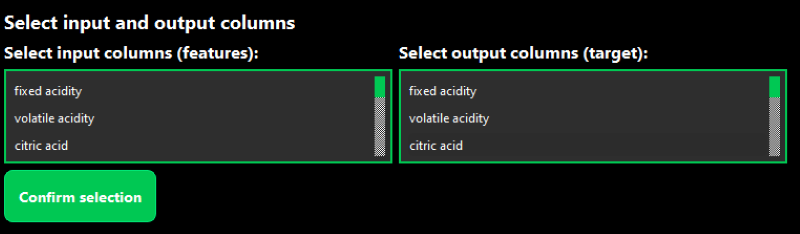
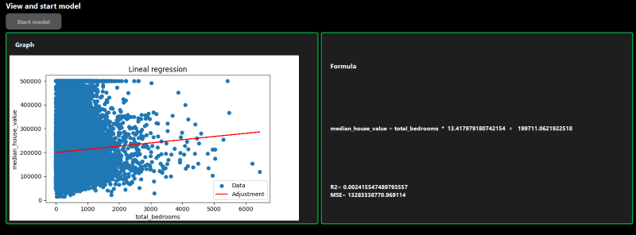
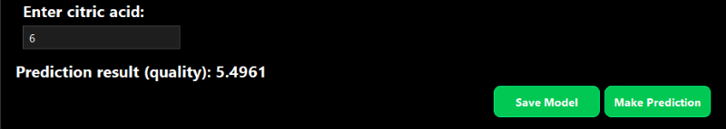
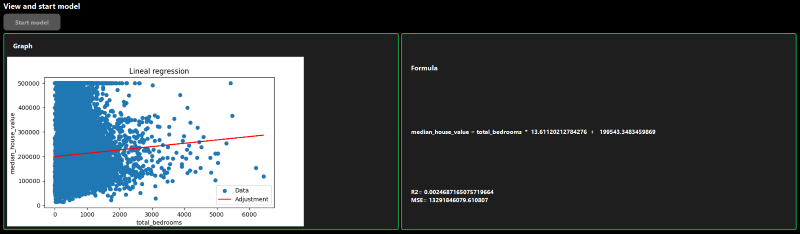
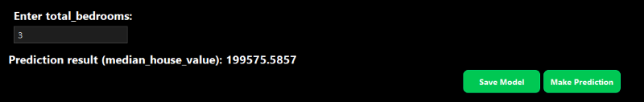
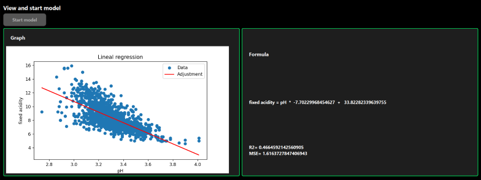

# Linear Reg
This guide is intended for anyone using Linear Reg for the first time and serves as an introduction to Linear Reg's User Interface (UI), primary functions and usage, and making predictions. Users will be able to understand how linear regression can be used to support data-driven decision-making.

## Table of Contents
- [Linear Reg](#linear-reg)
  - [Table of Contents](#table-of-contents)
  - [Overview](#overview)
  - [Features](#features)
  - [Getting Started](#getting-started)
    - [Minimum Hardware and System Requirements](#minimum-hardware-and-system-requirements)
    - [Downloading Linear Reg](#downloading-linear-reg)
  - [Introduction to the Linear Reg Interface](#introduction-to-the-linear-reg-interface)
  - [Linear Reg Functions and Usage](#linear-reg-functions-and-usage)
    - [Uploading your Data](#uploading-your-data)
    - [Choosing your Variables](#choosing-your-variables)
    - [Preprocessing Missing Data](#preprocessing-missing-data)
  - [Building the Model](#building-the-model)
    - [Formula Overview](#formula-overview)
  - [Saving and Loading Models](#saving-and-loading-models)
  - [Making Predictions](#making-predictions)
  - [Use Case Scenarios for Linear Reg](#use-case-scenarios-for-linear-reg)
    - [Preparing Real Estate Estimates](#preparing-real-estate-estimates)
    - [Understanding Wine pH and Acidity](#understanding-wine-ph-and-acidity)
  - [Support and Contributions](#support-and-contributions)

## Overview
Linear Reg 1.0 is a software application that helps users easily create and work with [linear regression models](https://www.spiceworks.com/tech/artificial-intelligence/articles/what-is-linear-regression/ "linear regression models"). The intuitive interface makes it easy for users to apply basic machine learning algorithms to build predictive models and conduct data analysis. Users can quickly grasp how linear regression works and how it can be used efficiently.

## Features
Using mathematical formulas, Linear Reg can make predictions based on specific datasets and the relationship between numerical variables. By building linear regression models, users can predict the value of one variable based on the value of another. The tool also offers insights into the model's predictive formula, enabling users to assess models for accuracy, save their models for future use, and update data entries to suit specific scenarios.

## Getting Started
Linear Reg is a lightweight PC program. This section covers the program's requirements and how to download and run Linear Reg.

### Minimum Hardware and System Requirements
This section covers the minimum requirements needed to run Linear Reg.

* **Operating system**: Microsoft Windows 10 or 11
* **Processor**: Intel i5
* **Memory**: 4 GB
* **Storage**: 15 MB available space
* **Display**: 1080 x 768 

### Downloading Linear Reg
You can download Linear Reg in two different ways.

* Go to the [Releases](https://github.com/pfarinac/COIL_project/releases) page to download the latest stable release.
* [Download the source code](https://docs.github.com/en/repositories/working-with-files/using-files/downloading-source-code-archives) and extract the zip file. 

Once you have downloaded Linear Reg to your computer, click the Linear Reg icon to open the application.

## Introduction to the Linear Reg Interface
The user interface (UI) is divided into five main components: the data visualization window, input and output selectors, data preprocessing options, the graph and formula displays, and an optional model description field (Figure 1).

*Figure 1: The Linear Reg interface*

The steps to build a linear regression model are completed in these five sections. Table 1 describes each of the UI components. 

| UI Component          | Description                                                                   |
|:----------------------|:------------------------------------------------------------------------------|
| Data Visualization display | Upload and view your spreadsheet file (.csv). This information will be used to build the linear regression model.   |
| Input and Output selectors | Select the columns of data you would like the tool to use to make predictions.   |
| Data Preprocessing options | Indicate how you would like the tool to handle any missing or incomplete spreadsheet data, called "nulls." The **Count Null Values** function identifies how many cells within the selected columns are missing data. If you have missing data, Linear Reg lets you preprocess it in four ways: <ul><li>Delete rows with nulls</li><li>Replace nulls with mean</li><li>Replace nulls with median</li><li>Replace nulls with constant value</li></ul> |
| Graph and Formula display | View the graph of your linear regression model and prediction formulas. |
| Model Description | Enter key details related to a specific model. |

*Table 1: Overview of Linear Reg's interface components*

## Linear Reg Functions and Usage
This section describes how to use Linear Reg's functions to build linear regression models.

*Video 1: Walkthrough of Linear Reg*

### Uploading your Data
Before you can build your linear regression model, you must upload your dataset. Linear Reg only accepts datasets in the comma-separated values (CSV) format.

**To upload your dataset**
1. Click **Open**.
2. Navigate to your spreadsheet, select the file, and click **Open**. The spreadsheet displays in the Data visualization window (Figure 2).

*Figure 2: The Data Visualization window*

### Choosing your Variables
Once your dataset has been uploaded, select the input and output columns you would like to isolate to make your prediction (Figure 3). The "input feature(s)" are the variables used to make the prediction, while the "output target" is the outcome you aim to predict.

*Figure 3: The input and output selectors*

**To choose your input and output variables**
1. Select the input column(s). 
2. Select the output column. 
3. Click **Confirm selection**. The Information dialog box appears to confirm your selection has been saved. 
4. Click **OK** to dismiss the confirmation window.
5. Click **Count null values**. The Null Values dialog box appears to tell you how many cells are missing data within your specified columns.
6. Click **OK** to dismiss the confirmation window. If your dataset has no missing values, you can proceed with [building your model](#building-the-model).

### Preprocessing Missing Data
If your columns have missing data, Linear Reg must preprocess it before it can build the model. Table 2 describes the four ways Linear Reg can do this. 

| Data Preprocessing option | Use case |
| :---- | :---- |
| Delete rows with nulls | Analyze only complete records. Recommended if there's a small amount of missing data, and they have no patterns. |
| Replace nulls with mean | Replace missing data with column's average value. Used when there's a normal distribution of variables but is sensitive to outliers. |
| Replace nulls with median | Replace missing data with column's middle value. Used when the distribution is skewed as it's less sensitive to outliers. |
| Replace nulls with constant value | Replace the missing data with a specific value such as zero or an value that doesn't occur in the data. |

*Table 2: Summary of when to use each Data Preprocessing option*

**To set preprocessing options**
1. Choose how Linear Reg should handle any missing or incomplete data by selecting **Delete rows with nulls**, **Replace nulls with mean**, **Replace nulls with median**, or **Replace nulls with constant value**. The Replaced Values or Deleted Rows dialog box opens to confirm your selection.
2. Click **OK** to dismiss the window.

## Building the Model
Once your data is preprocessed and ready, you can now build your model.

**To build your model**
1. Click **Start model**. The Model created successfully dialog box appears.
2. Click **OK** to dismiss the window. The linear regression model (graph) and formula displays (Figure 4).

*Figure 4: The Graph and Formula displays*

### Formula Overview
The formulas have two values: R2 and MSE.

* **R squared** (R2) describes how well the input/output relationship affects the variation. This ranges from 0 (low correlation) to 1 (high correlation).
* **Mean Squared Error** (MSE) measures the difference between the model's predicted values and the actual data. A lower MSE means the model's predictions are close to the actual data, while a higher MSE means it's farther from the actual data and has a high error probability.

## Saving and Loading Models
Once the linear regression model has been built, you can save the model for future reference, including an optional model description. You can also load existing models to continue working with them. 

In the Model Description box, enter key details, such as what information variables were used, the relationships to predict, and the accuracy of those predictions.

**To save a model**

1. Click **Save Model**. 
2. Navigate to the folder you want to save your model in.
3. Enter the file name you want to save it as.
4. Click **Save**. The Information dialog box appears to confirm that the model has been saved successfully.  
5. Click **OK** to dismiss the window. The model is saved to the specified location on your computer. 

**To load an existing model**

1. Click **Load Model**. 
2. Navigate to the folder where your model is saved.
3. Click **Open**. The Load modal dialog box appears to confirm the model has been loaded successfully.  
3. Click **OK** to dismiss the window. The existing model opens and formula displays. 

## Making Predictions
Once you have built or loaded a model, a prediction field (labeled as the input column you selected) appears below the Model description field (Figure 5). You can now enter numerical values in that field to make predictions.

*Figure 5: The prediction field*

**To make a prediction**

1. Enter a numerical value in the **Enter a [feature]** field. 
2. Click **Make Prediction**. The prediction result (labeled as the output column you selected) appears. 

## Use Case Scenarios for Linear Reg
Linear regression can be used across various professional fields to uncover relationships between variables in many real-world scenarios. The following use case scenarios demonstrate how Linear Reg can be used by specific users for predicting future values based on existing data. 

### Preparing Real Estate Estimates
A real estate agent, Antonio, believes the number of bedrooms is an important factor influencing median house value and wants to provide better estimates to potential home buyers and sellers.

Antonio gathers a dataset of information from several home sales in his area and decides to create a simple linear regression model that predicts the price of a home (output) given the number of bedrooms (input). 

After uploading his dataset, he selects **total_bedrooms** as his input (features) and **median_house_value** as his output (target) and confirms. During preprocessing, Linear Reg shows that there are 200 cells with missing data. He opts to **delete the rows with nulls** then creates his model (Figure 6).

*Figure 6: Antonio's model and formulas*

Antonio decides to predict the median house value of 3-bedroom homes. He enters "3" (total_bedrooms), and the model predicts that the median house value for 3-bedroom homes would be approximately 199,575.59 (Figure 7).

*Figure 7: Antonio's prediction result*

### Understanding Wine pH and Acidity
Marie, a statistics student and a beginner wine enthusiast, wants to understand the composition of red wine and how it affects its taste. Using a dataset provided by a local winery, Marie decides to use Linear Reg to find the correlation between **pH** and **fixed acidity**.

After uploading her dataset, she selects **pH** as her input (features) and **fixed acidity** as her output (target) and confirms. Linear Reg reports that there are no null values, so she doesn't need to do any additional preprocessing. She creates the model (Figure 8).

*Figure 8: Screenshot of Marie's model and formulas*

Marie notices the relationship immediately: lower pH results in a higher fixed acidity. However, the R2 is only 0.46, so that means there are factors other than pH that can affect fixed acidity.

## Support and Contributions
For Linear Reg support or contributions, you can do one of the following:

* [Create a new issue](https://github.com/pfarinac/COIL_project/issues/new) to report a bug or provide feature requests.
* [Fork](https://github.com/pfarinac/COIL_project/fork) the repository and create a [pull request](https://github.com/pfarinac/COIL_project/pulls) to submit any bug fixes or features.